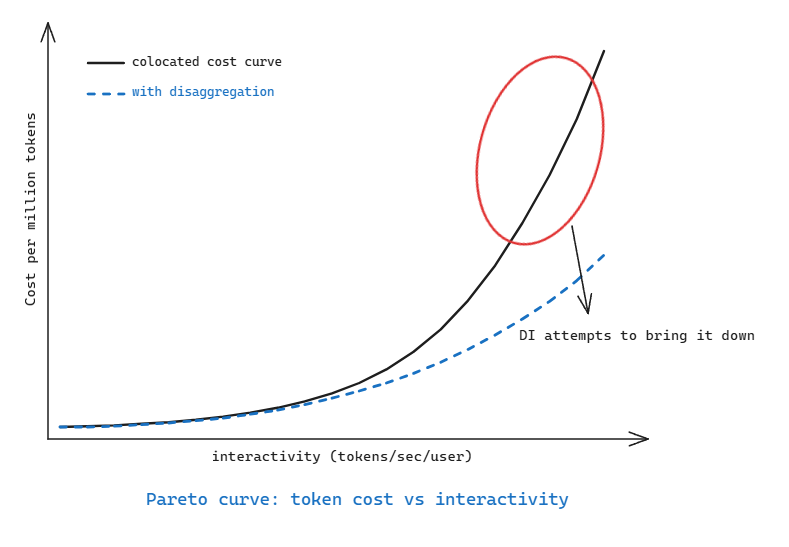
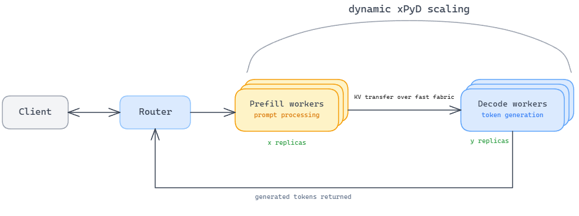

Disaggregated Inference (DI), also known as disaggregated serving, disaggregated prefilling, or P/D (prefill/decode) disaggregation, is an LLM serving architecture that separates the prefill and decode phases of inference onto different hardware resources. Compared to other LLM inference techniques, disaggregated inference is a relatively new and trending paradigm. Since this is a fast-moving area, in this post I will cover a higher-level conceptual view of DI, considerations for using it in production systems, and the recent trends as I see them.

### Background and motivation

It is fairly well known that LLM inference has two distinct phases of execution, prefill and decode, each with different requirements. Still, a couple of lines to recap. The prefill phase is when the LLM processes all the input tokens together; it is compute-heavy and relies on dense matrix-matrix multiplication. Modern GPU kernels have gradually improved over the last few years to tackle the compute challenge of the prefill phase. The decode phase, on the other hand, is when the LLM generates one token at a time, and it becomes extremely memory-bound: for every token, the LLM has to read all the weights from memory, and it does very little compute, since it relies on matrix-vector multiplication.

Another point worth noting is that inference providers and enterprises are very cautious about token cost. Reducing the cost per token calls for high-throughput serving, but that hurts interactivity, the individual user's experience in terms of the tokens per second they receive. The Pareto curve below shows that the higher the interactivity demand, the lower the batch size, which pushes the cost up. So the industry is working hard to improve interactivity (tokens/sec/user) while keeping cost low, or keeping throughput high. Disaggregated inference is one of the main techniques for pushing down that steep, high-interactivity part of the curve.

{#fig-pareto width=75%}

The primary benefit of disaggregated serving is improving interactivity. When both phases run colocated on the same GPU, the decode phase can suffer because of the prefill of an incoming request, since continuous batching lets new requests join the running stream at any time. Each request in the decode batch can then get interrupted (a form of "head-of-line blocking"), so the ITL (inter-token latency) becomes irregular and interactivity suffers. With disaggregation, the decode phase runs in its own decode GPU pool, so it reaches a steady state with a stable ITL.

Beyond that primary benefit, a disaggregated setup brings a few additional ones:

1. Independent optimization and scaling. Since prefill and decode workers are separated, they can scale independently to maximize throughput as the workload varies, with independent parallelism, batching, and P:D ratio flexibility.
2. Hardware flexibility. Different types of accelerators can be used for each phase, one that fits compute-bound prefill and another that fits memory-bandwidth-bound decode.

It is worth remembering that disaggregated inference is not free. It adds scheduling, routing, scaling, and KV cache transfer challenges, as discussed in the remaining sections. So it is important to weigh these extra costs against a colocated setup. In colocated inference, chunked prefill is a well-known technique that mitigates the same head-of-line blocking issue, splitting a long prefill so it does not stall the steady-state decode speed.

### Scheduling, routing, and scaling considerations

In a Kubernetes-native distributed inference system, there are usually a few main components:

- The **Kubernetes scheduler**, which places pods on nodes.
- The **router**, which sits in the request/data plane and routes incoming requests to the serving backend.
- The **autoscaler**, which operates in the control plane and adjusts the number of serving replicas.
- The serving pools, which run the actual inference workload.

In a distributed and disaggregated inference system, we deal with a few more granularities:

- **Prefill pools** contain servers dedicated to the prefill workload.
- **Decode pools** contain servers dedicated to the decode workload.
- **KV connectors** or **transfer engines** move KV cache data from prefill workers to decode workers in the data plane.

{#fig-diflow width=90%}

Disaggregated inference introduces a **co-scheduling problem**: prefill and decode workers are separate but tightly coupled, so their placement, scaling, and routing all need to be coordinated rather than handled independently. The three main components, the router, the autoscaler, and the Kubernetes scheduler, each help with this at a different level.

The Kubernetes scheduler should ensure **physical proximity** during the initial pod placement. Prefill and decode pods need to sit physically close to each other (same rack, zone, and so on) so that KV cache transfers between them stay fast and low-latency. This is handled by **topology-aware placement**, often combined with **gang/co-scheduling** so the tightly coupled prefill/decode workers are admitted and placed together.

The router is a key component of the distributed and disaggregated inference system, and it routes each request. LLM-aware routing is fundamental to reducing inference cost. Several heuristics can factor into picking the best endpoint:

- **Load-aware routing**: it picks the best endpoint based on load (request queue depth, running requests, available KV cache memory, and so on).
- **Prefix-cache-aware (KV-aware) routing**: the router picks endpoints to maximize the prefix cache hit rate during prefill.
- **KV-transfer-aware routing**: in a disaggregated setup, the router also needs to account for KV cache transfer cost and pick prefill and decode endpoints that minimize it. Topology-aware routing ensures the prefill and decode pair are physically close, which maximizes KV transfer efficiency.

**Fallback to colocation.** One important caveat: disaggregation is not always worth it for every request. An intelligent router can recognize this and route the request entirely to a decode server, which then does both prefill and decode and generates all the tokens. This can make sense under a few conditions:

1. If the prefill is short, it can be computed efficiently in the decode engine by piggybacking chunked prefill onto ongoing decode requests, avoiding a small and wasteful KV transfer.
2. Prefix cache hit: when the relevant prefix is already cached on the decode server, prefill becomes memory-bound and is more efficiently handled right there in the decode engine.
3. When the prefill queue is overloaded, it can be better to serve the request on the decode server until more prefill workers are added.

**Dynamic xPyD (the autoscaler).** Disaggregation imposes its own scaling requirements on the prefill and decode pools. A prefill-heavy workload, such as summarization or large-document processing, can bottleneck on the number of prefill servers even while the decode servers sit underutilized. A decode-heavy workload, such as long reasoning tasks, can bottleneck on the decode side instead. So a static ratio like 1:1 prefill-to-decode often leads to underutilized hardware and suboptimal performance. This is why distributed inference frameworks such as **NVIDIA Dynamo** (with its **SLA-based Planner**) or **llm-d** (with its **Workload Variant Autoscaler**, **WVA**) watch signals like prefill queue depth, decode-side KV cache usage, and SLO targets, and scale the prefill and decode pools accordingly.

### The transport layer: KV cache movement

The KV cache transfer from the prefill pool to the decode pool is critical, since a slow transfer path wipes out the benefit of disaggregation. Inference engines such as vLLM and SGLang, and distributed inference frameworks such as Dynamo and llm-d, all tend to use one or more high-performance data transfer libraries such as **NVIDIA's NIXL** or **AMD's MoRI-IO**. These libraries **avoid CPU staging** (copying from the source GPU's HBM to host RAM over PCIe before sending it to the destination GPU) and use **asynchronous transfers** over the ultra-fast interconnect fabric to keep it as efficient as possible.

{#fig-stack width=75%}

These transfers are asynchronous and can overlap with other work, although the decode side is still gated by the required KV blocks for that specific request. Both keeps serving other requests while KV blocks move in the background. There is also a choice in which side drives the transfer. The prefill side can push KV blocks to the decode workers as it produces them, or the decode side can pull them once it needs them. Pushing is usually preferred, because the prefill worker can start streaming blocks as soon as they are ready instead of waiting for the whole prefill to finish. Under the hood, the transfer libraries move data directly between GPUs and skip host memory. Across nodes they use **RDMA** over a network fabric, either **InfiniBand** or **RDMA-enabled Ethernet** such as **RoCE**, and within a node they use GPU-to-GPU peer-to-peer over a fast interconnect such as **NVLink** or **xGMI**. The goal is always to keep the KV cache moving over the fastest link available, without a detour through host memory.

For sparse-attention models such as **DeepSeek-V3.2 with DeepSeek Sparse Attention (DSA)**, KV access becomes much more fine-grained, since the decoder only needs selected KV entries. That makes **CXL-backed KV memory pooling** an interesting emerging direction, where the KV cache can stay in a shared memory pool and be accessed on demand rather than relying only on RDMA-style transfer. This is still research/emerging-system territory, because shared CXL memory introduces synchronization and consistency challenges.

### Hierarchical KV cache management with disaggregated inference

In a disaggregated setup with many servers running, reusing the KV cache across all of them efficiently becomes very important. A **KV cache management layer** such as **LMCache** turns the KV cache from a temporary artifact into a reusable, persistently stored asset that can be shared across multiple serving engines. It moves KV cache out of GPU memory into a tiered storage hierarchy spanning CPU memory, local storage, and remote backends. This offers a **decoupled handoff** instead of a strict point-to-point transfer from prefill worker to decode worker, and offloading KV cache off the decode workers also helps sustain high throughput. In today's agentic workloads, with massive documents, long histories, or multi-turn conversations, the generated KV cache can be reused this way, avoiding repeated prefill compute. For that remote tier, LMCache can plug into a distributed store like **Mooncake Store**. LMCache stays the management layer, deciding what to keep, offload, and reuse, while Mooncake Store provides the high-performance shared storage that any engine can read from and write to. 

### MoE and multimodal models

Disaggregated inference is now entering the mainstream through popular inference engines such as vLLM and SGLang, which support it within a node along with efficient KV cache transfer through various KV connectors. Serving frameworks such as Dynamo and llm-d sit on top of these engines and add disaggregation-aware scheduling, routing, and autoscaling inside Kubernetes-class clusters. Some model families such as **MoE** and **multimodal** models can benefit from disaggregation even more.

For large-scale MoE serving, disaggregation becomes increasingly important, because these models lean on **Data Parallel Attention (DPA)** and **Expert Parallelism (EP)** to scale inference. EP relies on sparse all-to-all dispatch and combine operations to route tokens to their experts. In a colocated setup, decode ranks can end up waiting behind ranks that are processing large prefill batches, which delays the all-to-all communication and creates pipeline bubbles. Disaggregation avoids this by separating prefill and decode into different GPU pools, keeping each pool more homogeneous and easier to optimize.

Multimodal and vision-language models do not start inference at prefill. A request first goes through an encoder stage that turns raw images, video, or audio into tokens the language model can consume. That encoding step is heavy on compute but runs only once, at the very start of a request. If the encoder shares hardware with prefill, the two compete for the same GPUs, so a burst of image-heavy or video-heavy requests can hold back the prefill and decode work and drag down utilization. **Encode-Prefill-Decode (EPD)** disaggregation pulls the encoder out into its own pool so it can be scaled on its own curve, and it layers naturally on top of P/D disaggregation to give a three-stage pipeline: encode, then prefill, then decode.

### Recent trends: hardware heterogeneity

Separating prefill from decode opens up the option of using an entirely different accelerator for decode, one that may suit memory-bound work better than a GPU. **SRAM-centric accelerators** are an active area of research here. A GPU has to read all the weights and KV cache from off-chip HBM to generate each token, which is a big memory bottleneck. An SRAM-centric accelerator, by contrast, is well suited to bandwidth-heavy work because it keeps data in fast on-chip SRAM. These chips may not have a tiered memory system, so they avoid the delay of moving data from off-chip to on-chip memory. Because on-chip SRAM typically offers a wide access path distributed across the chip, it gives the compute units a faster path to data and a low-latency decode phase, exactly where GPUs are usually held back by memory bandwidth.

In the first half of 2026, I have seen a string of announcements and trends around heterogeneous disaggregated inference. I find these really interesting, and I am curious how they all play out. I will mention a few of them here. 

NVIDIA announced its **Attention-FFN Disaggregation (AFD)** approach, where the feed-forward layers of the decode phase are accelerated on Groq's LPU. Every layer of an autoregressive LLM is an attention block followed by a feed-forward block. The attention block reads and writes the growing KV cache, so it stays on the GPU. The feed-forward block after it does not touch the KV cache; it only needs the attention output, so it runs on the LPU, and this hand-off repeats at every layer.

Some of the more recent announcements, such as disaggregated inference with [AWS Trainium and Cerebras's wafer-scale chip](https://www.cerebras.ai/press-release/awscollaboration) and with [Blackwell GPUs and SambaNova's RDU](https://sambanova.ai/blog/first-disaggregated-inference-demo-for-ai-agents-live), reflect the same trend.

**Speculative decoding disaggregation.** Inference engines use speculative decoding to speed up the decode phase, mainly with a target-conditioned draft model doing generation and the target model doing parallel verification. There is ongoing industry work to decouple the draft and verification phases and run them on different hardware. The draft phase, for instance, can benefit from an SRAM-based chip: a recent [write-up from Gimlet Labs and d-Matrix](https://gimletlabs.ai/blog/low-latency-spec-decode-corsair) showed the performance gains of this approach. Systems research is exploring the same idea from other angles. [ByteDance's SwiftSpec](https://arxiv.org/pdf/2506.11309) and [Together AI's Speculative Speculative Decoding](https://arxiv.org/pdf/2603.03251), for example, show how the draft and verification stages can be placed on separate GPU resources and overlapped asynchronously.

### Wrapping up

Stepping back, disaggregated inference comes down to one idea: stop forcing two workloads with opposite bottlenecks to share the same GPU, and let each run where it fits. That is what lets a system push interactivity and throughput at the same time instead of trading one for the other, which was the tension we started with. But the idea only pays off when the surrounding pieces are in place, the routing, the scheduling, and above all a KV transfer path fast enough not to eat the benefit. Disaggregation is a scaling tool, not a default. At small scale or over modest interconnects, a well-tuned colocated setup is often the better choice. The better systems treat it as something to move into and out of rather than a fixed decision.

It is also very interesting to see that the nature of disaggregation keeps moving. It began as a clean prefill/decode split and is now being pushed toward finer and more heterogeneous cuts, down to individual layers, phases, and purpose-built accelerators. Where it settles is still open. My guess is that the basic P/D split becomes a standard building block that most serving stacks simply have, while the more aggressive forms stay workload-specific for a while. Either way, the underlying move of matching each part of the computation to the hardware it actually needs is here to stay.
