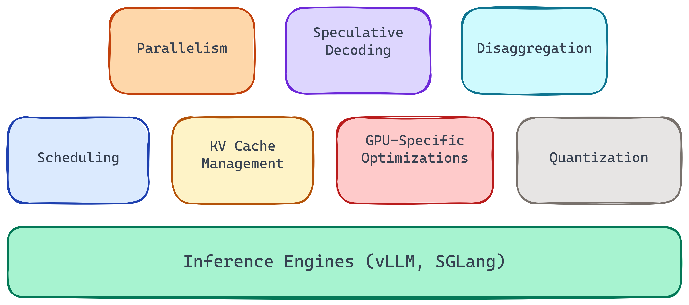
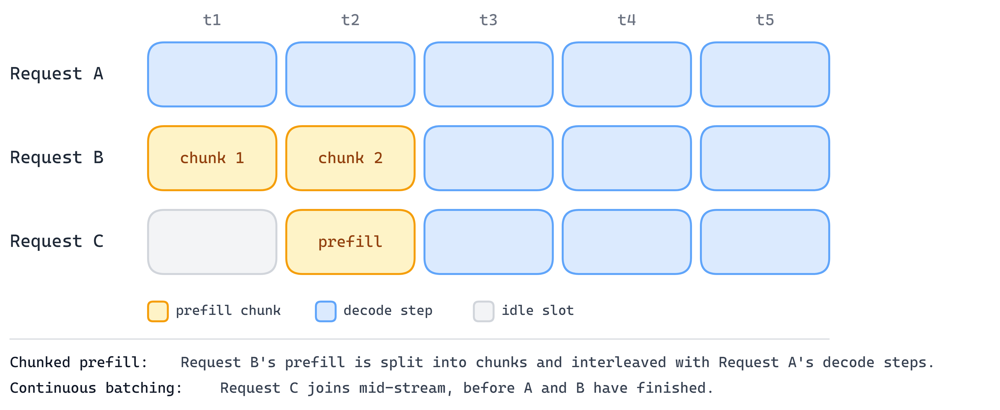
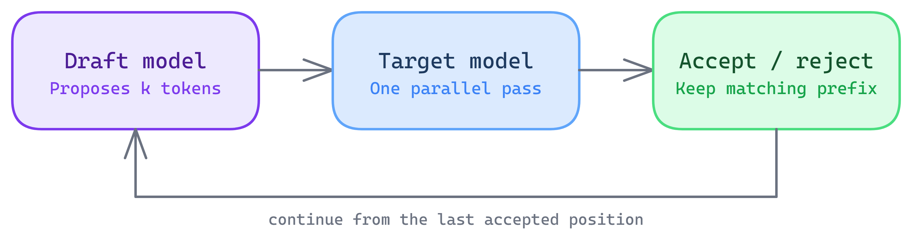
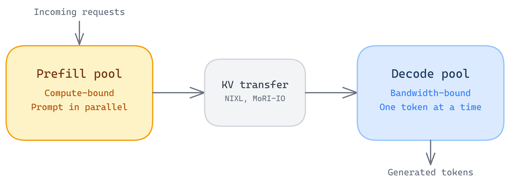

LLM inference engines like **vLLM** and **SGLang** have become the workhorses of LLM serving, both in the datacenter and increasingly at the edge. They ship new features, integrations, and subprojects almost every few weeks. But underneath all that rapid development, there is a fairly stable set of foundational capabilities that every production-grade inference engine has to get right. This post introduces the core foundational feature set of modern inference engines like vLLM and SGLang. I have organized them into seven categories, ordered from the most basic to the most advanced.

## 1. Scheduling

Scheduling is the most fundamental feature of an LLM inference engine. At its core, an inference engine is scheduling bursty, irregular requests from many users at once, trying to keep GPU utilization high and serving cost low while still meeting per-user SLOs for interactivity and maintaining some notion of fairness. On top of that, engines add more advanced scheduling features such as priority scheduling and preemption. A couple of the key mechanisms such as continuous batching and chunked prefill, are designed specifically to make this scheduling efficient.

- **Continuous batching** -- instead of waiting for an entire batch to finish before starting new requests, the scheduler inserts new requests into the running batch as soon as slots open up. This keeps the GPU busy and reduces scheduling delays.
- **Chunked prefill** -- long prompts are split into smaller chunks and interleaved with prefill and decode steps from other requests, preventing a single large prefill from blocking the entire batch.

Every inference engine works hard at getting scheduling right, because it directly drives the trade-offs between throughput, latency, SLOs, fairness, and memory pressure. Most of the other features in this post exist to give the scheduler more room to make those trade-offs well.

## 2. KV Cache Management

Once a token has been processed through the model's attention layers, its computed key and value vectors are cached so they don't need to be recomputed at every subsequent step. This KV cache becomes the dominant working memory during serving, often consuming more GPU memory than the model weights themselves. Managing this KV cache is the second most critical capability:

- **Paged attention** -- borrowed conceptually from OS virtual memory, paged attention allocates KV cache in fixed-size blocks rather than contiguous per-request buffers. This reduces memory fragmentation, allows more requests to fit in memory simultaneously, and prevents out-of-memory errors that would otherwise force request rejection.
- **Prefix caching** -- many requests share common prefixes (system prompts, few-shot examples, shared document context). Prefix caching detects these overlaps and reuses the cached KV blocks instead of recomputing them, saving both compute and memory. Different inference engines use different data structures to manage and retrieve these common prefixes. SGLang, for example, calls its prefix-caching mechanism **RadixAttention**, because it uses a radix trie.
- **KV offloading** -- GPU memory is finite. Offloading extends effective KV cache capacity by moving KV cache blocks across a memory hierarchy (GPU HBM to CPU DRAM to SSD), bringing them back when needed. This trades some latency for the ability to handle longer contexts or more concurrent requests. **LMCache** is a popular KV cache management library that handles this efficiently, and it currently integrates several KV cache transfer backends with vLLM. SGLang has its own native offering for this, called **HiCache**.

A quick mental recap: paged attention solves how the KV cache is arranged or packed inside GPU memory, prefix caching makes sure those KV blocks get reused, and KV offloading extends storage beyond the GPU when its memory becomes insufficient to hold a growing KV cache.

## 3. Uplifting GPU-Specific Optimization

GPUs are extremely powerful, but getting the best out of them is notoriously hard. For years, GPU programmers, both at the major vendors and in the open-source community, have spent countless hours writing high-performance kernels. The Transformer is the seminal architecture for modern LLMs, but its core algorithm brings severe challenges in terms of memory and compute. **FlashAttention** was one of the earlier kernel implementations to directly address the memory bottleneck of the attention mechanism, using tiling, clever fusion, and the online-softmax technique. In recent years we have seen many other optimization kernels:

- **Attention kernels** -- FlashAttention and its newer variants keep squeezing the latest and greatest GPU features, and kernels like **SageAttention**, **DeepSeek's Sparse Attention**, and **Multi-head Latent Attention (MLA)** have been developed to cater to the attention variants that modern LLMs use. These kernels are carefully designed to fuse the attention computation and minimize HBM reads/writes, which are the primary bottleneck during both prefill and decode.
- **GEMM optimization** -- matrix multiplications dominate compute time. Inference engines use vendor-tuned GEMM libraries and auto-tuning to pick the best kernel for each shape (batch size, hidden dimension, sequence length, precision). Since GEMM is one of the most compute-intensive operations, several optimized versions have been developed, such as **persistent-kernel GEMM**, **Split-K**, and **Stream-K**.
- **Architecture-specific kernels** -- newer model architectures introduce new kernel needs. **MoE** (Mixture of Experts) layers and hybrid-attention variants such as **Mamba** and **GatedDeltaNet** are getting very common, and each needs its own kernel support to run efficiently.

Now, the user of an inference engine should not have to worry about developing or even picking the right kernel. The inference engine should serve as the bridge between high-level serving APIs and low-level hardware performance, using the efficient kernel out of the box and keeping it transparent to the end user.

Beyond optimized kernels, a few other techniques are integrated inside the modern inference server.

- **CUDA/HIP graphs** -- the CPU overhead of launching many small GPU kernels per step adds up, and this is very common in the LLM decode phase, where the LLM generates one token at a time. CUDA/HIP graph capture records a sequence of kernel launches once and replays them with minimal CPU involvement, reducing per-step overhead and noticeably cutting the latency of request completion.
- **Compiler paths** -- PyTorch's **torch.compile** and related compiler infrastructure can fuse operations, eliminate memory copies, and generate optimized code for patterns that don't have a hand-written kernel. This is a popular path when you want to write your own custom kernel with a unique prologue or epilogue that can be accelerated on the GPU.

Without all of this kernel and compiler work, the scheduler and KV cache manager would just be orchestrating requests on hardware that never gets anywhere near its real performance potential.

## 4. Quantization

Without quantization, serving LLMs at scale would probably be impossible. Quantization directly addresses the memory-bandwidth and footprint battle. It reduces the LLM's footprint, so that sometimes it can be loaded onto a single GPU's memory, and it reduces memory-bandwidth pressure, which especially helps the decode phase of LLM serving.

- **Weight quantization** -- reducing model weights from FP16 to INT8, INT4, or even lower bit-widths cuts memory footprint proportionally. A 70B-parameter model at FP16 needs ~140 GB, but at INT4 it fits in ~35 GB. Depending on the GPU's memory, that can be the difference between needing multiple GPUs and a single one.
- **KV cache quantization** -- quantizing the KV (key-value) cache to FP8 or INT8 can significantly reduce its memory footprint. More recent work like **TurboQuant** pushes this further, quantizing the KV cache to as low as 3 or 4 bits and dequantizing back to bf16 for the attention computation.

Modern inference engines offer various quantization algorithms, such as **GPTQ**, **AWQ**, and **FP8**, covering both weight-only and weight-plus-activation quantization, through multiple quantization libraries and tools such as **NVIDIA's Model Optimizer** and **AMD's Quark**, and they support both offline and online quantization. More recently, 4-bit formats such as **NVFP4** and **MXFP4** have been gaining ground for the latest LLMs.

## 5. Parallelism

A model and its KV cache often won't fit on a single GPU. Distributed inference uses multiple GPUs (and multiple nodes) to get past those limits. The right parallelism strategy depends on model size, batch size, context length, and cluster topology.

**Tensor parallelism (TP)** splits individual layers (weight matrices) across GPUs. Each GPU computes a slice of every layer, and then they synchronize via an all-reduce. TP gives low latency but requires a fast interconnect (NVLink/xGMI), so it is typically used within a single node.

**Pipeline parallelism (PP)** splits the model by layers, or stages, across GPUs. Each request flows through stage by stage, while different requests or microbatches keep the different stages busy. It is useful for scaling throughput on large models when TP would require too much communication and would hurt latency.

**Data parallelism (DP)** gives each GPU a full model replica, with different GPUs handling different requests. It is simple and effective when the model fits on one GPU and you just want to scale throughput. More recently, **Data Parallelism Attention (DPA)**, also known as **DP Attention**, has emerged as an advanced strategy that is especially beneficial for MLA models such as DeepSeek, MiniMax, and Kimi-K2, reducing KV cache memory pressure, allowing larger batch sizes, and improving decode throughput.

**Context parallelism**, also called **Sequence parallelism (CP/SP)** especially in the prefill phase, distributes the sequence dimension across GPUs. It is very useful when a very long prompt would otherwise make the prefill stage hurt TTFT, and techniques such as **Ring Attention** are adopted for efficient prefill context parallelism. In the decode phase, context parallelism essentially shards the KV cache across the KV heads and along the token-sequence dimension, which is especially useful for MLA- or MQA-based LLMs. Context parallelism helps address a large-batch KV cache that would otherwise overflow a single GPU's capacity.

**Expert parallelism (EP)** distributes the experts of an MoE model across different GPUs. It is commonly combined with other parallelism strategies, including tensor parallelism, which can be applied to the experts themselves (a single expert sharded across multiple GPUs) as well as to the shared layers.

In practice, production deployments on popular inference servers often combine multiple strategies (e.g., TP within a node + PP across nodes, or TP + EP for large MoE models).

## 6. Speculative Decoding

An LLM's autoregressive decoding phase is inherently sequential: each token depends on the previous one. This makes the decode phase latency-bound and hard to parallelize. Speculative decoding attacks this bottleneck.

The core idea: a smaller, faster **draft model** generates several candidate tokens ahead. Then the full **target model** verifies those tokens in a single forward pass (which is parallel, like prefill). Accepted tokens are generated at the faster draft-model speed but validated at target-model quality. Rejected tokens are discarded, and decoding continues from the last accepted position.

This can deliver a latency improvement in time-to-completion without changing model output quality, since the verification step guarantees that the output distribution matches the target model.

Speculative decoding is currently an active research area, and new, novel techniques are evolving very frequently. The **EAGLE-3** technique has been adopted inside popular inference frameworks; it is target-conditioned (the target model's hidden layers act as the draft model) and provides a higher acceptance rate. Newer techniques such as **DFlash** and **P-EAGLE** try to improve speed further through concurrent drafting. **Speculative Speculative Decoding (SSD)** takes another approach to improving speed, attempting to eliminate the phase-locked split between the drafting phase and the verification phase by overlapping them. DeepSeek just came up with another improvement technique, **DSpark**, which introduces semi-autoregressive generation with confidence-scheduled verification.

I anticipate that newer and more novel speculative-decoding techniques will become native, first-class features in popular inference frameworks, as many of the newer techniques are currently being explored through subprojects.

## 7. Disaggregation

Prefill and decode stress the hardware very differently. Prefill is compute-bound (processing the entire prompt in parallel) and benefits from high FLOPS. Decode is memory-bandwidth-bound (reading weights for one token at a time) and benefits from high memory bandwidth and large batch sizes.

Running both phases on the same GPU means the hardware is never optimally utilized for either workload. Disaggregation separates them and uses distinct GPU pools for prefill and decode, optimized differently. Prefill GPUs are optimized for raw FLOPS and compute saturation, whereas decode GPUs are optimized for maximum data-transfer rate, low latency, and caching. The KV cache transfer between the pools is handled by efficient libraries such as Nvidia's **NIXL**, AMD's **MoRI-IO**, **LMCache**, and **Mooncake**, working with the inference engines.

Disaggregation is a relatively new addition to LLM serving engines, but the trend is growing. We are seeing specialized accelerators for the decode phase, and even more fine-grained disaggregation between different parts of the LLM, such as **AFD (attention-feedforward disaggregation)**. Disaggregation is even being used in more advanced use cases, such as **EPD** disaggregation for VLMs, where the Encode, Prefill, and Decode phases are disaggregated, or splitting the draft phase from the verification phase in speculative decoding.

---

## Wrapping Up

I hope this high-level overview of an inference engine's core capabilities gives you a breadth-first view of the essential inference techniques. This field is clearly growing fast, and new capabilities are constantly being added to the popular inference engines, such as serving multimodal and omnimodal LLMs, constrained decoding to support tool-calling integration for agentic applications, and multi-LoRA serving. But to get the best performance per dollar and performance per watt, it is these core foundational features that get tuned and that new techniques get experimented on. Understanding them gives you a mental framework for evaluating any inference engine against your own LLM serving needs.
