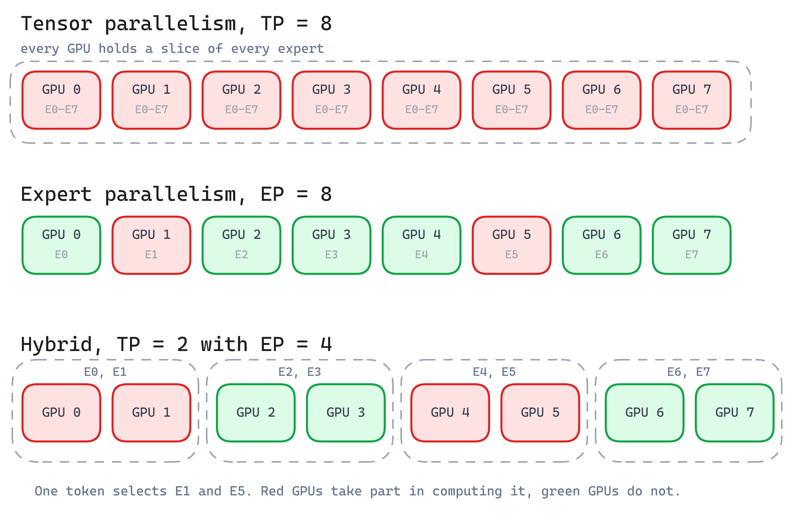

Draft

Since 2025, Mixture of Experts (MoE) has become a popular architecture for recent LLMs. MoE packs more capacity into a model while keeping the compute budget steady. An MoE layer replaces the traditional dense feedforward layer with multiple specialized "expert" layers, and for each token only a subset of the experts are activated. Each token is processed by the top-k most relevant experts (typically k=1-8), chosen by a learned router. This lets a model hold billions of parameters but compute only a fraction of them for any given token, which breaks the linear relationship between model size and compute cost. Because of this benefit, MoE has been widely adopted across the industry. Recent model families like GLM, DeepSeek, MiniMax, Kimi, Gemma 4, and Nemotron 3 all have MoE variants.

MoE solves the compute problem, but it creates a memory problem. Even though only a few experts run per token, the full set of expert weights still has to sit in GPU memory in a standard GPU-resident serving setup. Most MoE models today are far too large to fit on a single GPU, so parallelism is used first to distribute the expert weights across a large fleet of GPUs. But distributing the experts opens new challenges. How do we speed up the communication between GPUs and hide its delay? And how do we handle tokens that flow disproportionately to a few GPUs, causing imbalance and stalls?

This post works through these challenges in layers, grouped as memory pressure, communication pressure, and imbalance pressure, along with the techniques that have become common for each. Many of the current industry documents are tied to specific inference engines or GPU vendors, with their implementation details. So I will keep this post general, without going into framework-specific knobs or benchmark numbers.

## MoE architecture recap

A quick recap of the MoE architecture is worthwhile before diving into the main sections.

The main difference between an MoE model and a dense LLM is that an MoE model has three distinguishing modules:

1. Router: chooses which experts each token goes to.
2. Routed experts: MLPs that process only their assigned tokens. In some models such as DeepSeek-V3, the routed experts are divided into groups and the router selects hierarchically. It first picks a limited number of expert groups, then chooses the top experts within those groups.
3. Shared experts: optional MLPs that process every token, independent of routing.

Modern MoE models also combine these sparse expert layers with attention variants such as GQA and MLA to reduce the KV-cache footprint during inference. GQA, which uses fewer key and value heads than query heads, has been widely adopted since 2023. More recent leading MoE models, including `DeepSeek-V2/V3`, `GLM-5/5.2`, and `Kimi-K2`/`Kimi-K2-Thinking`, use MLA, where the key and value vectors are projected into a compressed latent representation for caching. Because of this, attention and MoE parallelism have to be considered together when designing an efficient end-to-end inference strategy.

## Memory pressure

Traditionally, for large models that cannot fit in a single GPU's memory, tensor parallelism (TP) and pipeline parallelism (PP) are the two main ways to deal with the memory pressure. MoE adds a new parallelism dimension, expert parallelism, or EP. TP works by splitting the large matrices across GPUs, so a pure TP configuration for an MoE model means every expert's matrix multiplications are sharded across every GPU in the TP group. That raises the communication cost, because even though only a few experts are selected per token, every rank still takes part in the communication.

**Expert parallelism** instead parallelizes the expert structure itself. Different experts are placed on different GPUs. Tokens are routed to the GPUs holding their selected experts, and those GPUs run the experts locally. Compared to TP, EP keeps each expert's GEMM larger and more efficient, and it reduces synchronization inside an expert when the expert fits on a single GPU. The expert layers can now scale independently across a large fleet of GPUs, while the dense layers and attention scale with their own TP on a smaller number of GPUs.

**Choosing between TP and EP**: One common intuition is that with a small number of experts TP is often better, since it gives good load balancing without the overhead of expert parallelism. With a large number of experts, EP is usually the better choice because it preserves sparse communication. In EP, tokens are sent only to the GPUs holding their selected experts, whereas TP requires the full TP group to participate in every selected expert computation. The model's intermediate size matters too. A large intermediate size benefits from TP, because the big matrix multiplication shards well across GPUs. With a smaller intermediate size, TP becomes less useful and EP is preferred. 

In practice, a hybrid TP+EP strategy is very common, where a moderate TP combined with EP gives a more balanced result.

{width=90%}

**EP size in prefill and decode**: The two phases are often configured at different EP sizes in large-scale, optimized MoE serving setups. Prefill processes many tokens at once, so each expert receives a large batch and the expert GEMMs keep the GPUs well utilized even at a small EP size. Decode processes only one new token per request at each step, so expert execution is dominated by loading the expert weights. A larger EP size spreads those weights across more GPUs, reducing the weight each GPU has to read and increasing the aggregate memory bandwidth.

**Wide-EP**: EP taken to a large scale is called wide-EP. Experts are spread across many GPUs, so the per-GPU weight memory drops and more room is left for the KV cache. This suits models with many experts, such as DeepSeek-V3, in long-context serving.

**Router and shared-expert parallelism**: EP distributes only the routed experts. The router is a small dense layer, so its weights are usually replicated across ranks, with each rank computing the expert assignments for its local tokens. The shared expert processes every token, so it is parallelized like a regular dense MLP layer: replicated when tokens are split with DP or sequence parallelism, or sharded with TP when its weights are large.

**Combining DP attention with EP**: DP attention is a somewhat orthogonal topic, but it is worth discussing alongside MoE memory pressure, since the recent MLA-plus-MoE trend puts pressure on both the attention memory and the expert memory at the same time. For example, DeepSeek-V3, a popular model for inference benchmarking, has 256 routed experts, and its attention layers use MLA, where tensor parallelism provides limited benefit. Newer open-source models such as GLM-5 and Kimi-K2 followed this same MLA-plus-MoE pattern. This has made Data Parallel Attention (DP attention) for the attention layers, combined with EP for the expert layers, a common serving pattern that has to be considered end to end.

For an MLA model, using TP on the attention layer duplicates the KV cache across all ranks, which goes against the whole point of MLA, whose goal was to reduce the KV-cache footprint. So in DP attention, data parallelism is applied only to the attention layers. The attention layers are replicated across GPUs, and each GPU handles a different set of requests and keeps the KV cache for those requests. This avoids duplicating the same request's MLA KV cache across TP ranks. 

The output of each DP attention rank is then passed to the MoE layers. In the dispatch phase, EP sends the tokens to their selected experts on the EP ranks, and in the combine phase the results are gathered back to the original DP attention rank.

This way, DP attention for the MLA layers and EP for the expert layers give each part of the model the parallelism strategy that fits it.

**MoE weight offloading**: Expert weights can take up a large part of the GPU's HBM, leaving less room for the KV cache, especially in long-context serving. As with KV-cache offloading, the expert weights can be kept in host memory instead of GPU HBM. Before a given MoE layer runs, its weights are prefetched back to the GPU, and asynchronous prefetching can overlap this transfer with computation from earlier layers. This frees up space for the KV cache in large-batch or long-context cases. The tradeoff is the extra CPU-to-GPU transfer, which can add latency when it cannot be fully hidden.

## Communication pressure

Distributing the experts with EP eases the memory pressure, but it creates a new challenge: moving tokens across the network efficiently. Since each token goes to only a few experts, EP creates a sparse dispatch (send tokens to the GPU holding the assigned expert) and combine (send the result back to the GPU the token came from) pattern, which is sensitive to network topology and routing efficiency. To handle MoE-specific routing and irregular all-to-all exchange efficiently, GPU vendors and specialized projects such as DeepSeek AI have developed dedicated dispatch-and-combine libraries.

**Fast expert communication libraries: DeepEP, MoRI-EP**: Specialized libraries such as `DeepEP` and `MoRI-EP` provide MoE-specific communication APIs backed by custom GPU kernels. These kernels use GPU-level communication primitives such as `NVSHMEM`/`NCCL GIN` or `MORI-SHMEM`, depending on the GPU vendor and the implementation. The primitives in turn do P2P transfers within a node and `GPUDirect RDMA` (on NVIDIA GPUs) or `PeerDirect RDMA` (on AMD GPUs) across nodes. The underlying interconnects are typically `NVLink` or `xGMI` within a node, and `InfiniBand` or `RoCE` across nodes.

`DeepEP` and `MoRI-EP` use the router output to group tokens by destination expert, exchange these variable-length token sets across GPUs, and return the expert outputs to the original GPUs in the right order. The token activations can also be quantized, for example to FP8, before dispatch, which reduces the amount of data moved during the all-to-all.

**Communication and compute overlap**: `DeepEP` and `MoRI-EP` provide low-latency, high-throughput dispatch and combine primitives, and they expose them as asynchronous operations. Inference engines use that to hide the communication delay behind computation. Engines like vLLM use a **Dual Batch Overlap** (SGLang calls its implementation **Two-Batch Overlap**) scheduling strategy to hide the all-to-all latency. They split the incoming global batch into two smaller micro-batches. While one micro-batch is sending its tokens across the network (the communication phase), the GPU stays busy running the matrix multiplications (the computation phase) for the other micro-batch.

The routed-expert dispatch and combine can also be overlapped with the shared-expert computation, since the two paths are independent until their outputs are merged. For example, SGLang added **Single-Batch Overlap** (**SBO**) on top of two-batch overlap, which overlaps the shared-expert computation with communication inside a single batch.

**Optimized kernels for MoE**: Once the dispatched tokens reach their experts, fast, low-latency compute becomes important inside each expert. Each expert runs its own feedforward GEMM. These GEMMs have irregular shapes and are often very small during decode. Running them separately with a standard GEMM kernel leads to poor GPU utilization and high kernel-launch overhead. Specialized MoE kernels solve this with a few variants:

1. **Grouped GEMM**: runs the matrix multiplications for many experts resident on the same GPU, each with a different token count, in a single kernel.
2. **Fused MoE kernel**: combines steps like token permutation, expert GEMMs, activation, and, in some implementations, EP dispatch and combine into one larger kernel.
3. **Low-precision GEMM kernel**: uses low precision such as FP8 or FP4 to reduce compute and memory cost.

**Prefill and decode kernel layouts**: The two phases send very different numbers of tokens to each expert, so they need different token layouts for the expert GEMM.

In prefill there are usually many tokens, giving large expert GEMMs and throughput-oriented dispatch. Because of the high token volume, tokens are packed into contiguous layouts. The contiguous layout densely packs the actual token rows for local experts, avoiding a large fixed padded region for every expert, which improves throughput.

Decode usually has few tokens, giving small expert GEMMs that are sensitive to latency. To help with this, tokens are padded into fixed-size masked layouts, which allows a fixed CUDA graph that can be replayed to cut kernel-launch overhead and improve latency.

`DeepGEMM` on NVIDIA GPUs and the MoE and GEMM kernels in AMD `AITER` provide these optimized kernels.

## Imbalance pressure

Depending on the workload, some experts receive more tokens than others. The GPUs holding popular experts get overloaded with both communication and computation, while others sit underused. The MoE layer cannot finish until the busiest GPU is done, so one overloaded GPU becomes the straggler while the rest wait idle. This raises layer latency and lowers overall throughput.

**Expert Parallelism Load Balancer (EPLB)**: DeepSeek's EPLB addresses this by replicating popular experts and spreading the copies across GPUs. The idea is simple: add some redundant GPU slots and use them for copies of the busy experts. EPLB receives estimated expert loads, commonly derived from a moving average of historical routing statistics, and replicates the higher-load experts by copying their weights into the redundant slots, which evens out the load.

In the **global policy**, EPLB looks across all GPUs on all nodes and can place a replica on any GPU anywhere in the cluster. This is very flexible, but as the cluster grows it can increase cross-node traffic.

In the **hierarchical policy**, balancing happens in two levels. It is designed for grouped-expert models like DeepSeek-V3. At the cluster level, the algorithm assigns the expert groups across nodes. Then at the node level, the heavily loaded experts are replicated into the redundant GPU slots on the same node. This keeps an expert's replicas within their assigned node and reduces cross-node traffic.

DeepSeek also describes a policy per phase. Prefill runs at a smaller EP size, where the hierarchical policy keeps each expert group and its replicas within a node, reducing cross-node token traffic. Decode runs at a larger EP size, where the global policy allows replicas to be placed anywhere across the cluster.

**Dispatch-time load balancing**: EPLB creates the replicas, but at dispatch time the incoming tokens still need to be sent to whichever replica is less busy. Splitting them evenly can overload a GPU that is already busy with another expert's compute on the same GPU. Since the popular experts change from batch to batch, the load on each replica also changes from batch to batch. So dispatch-time load balancing decides how to spread the current batch across the replicas to keep the load even and avoid a bottleneck. A DeepSeek project called **LPLB** extends EPLB with **linear-programming-based dispatch-time load balancing**. It decides how the current batch’s tokens should be divided among the existing copies of each routed expert. SGLang has integrated an LPLB-based method for routed experts and uses **Waterfill** for shared experts.

**Prefill-decode disaggregation**: MoE inference also benefits from separating the two phases. Prefill routes many tokens, creating large all-to-all communication and large expert GEMMs, while decode routes far fewer tokens and is more sensitive to latency. When both phases share the same EP workers, a large prefill can tie up the communication fabric and the expert GPUs, and decode ends up waiting, which stalls its all-to-all and creates pipeline bubbles. Disaggregation avoids this by putting prefill and decode in separate GPU pools, so each pool can use its own EP size, communication mode, and kernels.

## Wrapping up

MoE keeps the compute budget small, but it moves the cost elsewhere. The weights, the token traffic, and the routing all grow, and MoE inference is the work of paying those three bills without letting any one of them dominate.

Everything above is about the steady-state inference path, a running server on a fixed set of GPUs. Production adds another layer around operation and resilience, and this is where things are moving fast right now. Elastic expert parallelism changes the EP configuration while the server is running. Fault-tolerance work redistributes expert weights onto a new set of GPUs when one drops out. Tiered and pooled expert storage treats HBM, host memory, and pooled memory as one hierarchy and keeps the hot experts near the compute. And there is a push toward vendor-neutral EP communication, with libraries like `UCCL-EP` trying to give the same dispatch-and-combine performance across different GPU and NIC vendors.

MoE inference is still very much a moving target, and I am curious to see how these pieces settle as the models keep getting larger.
